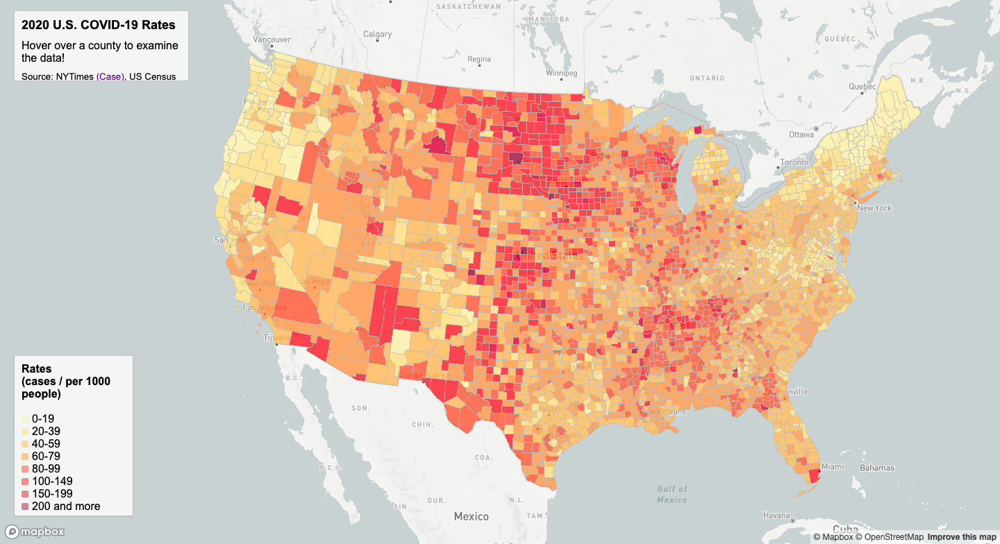
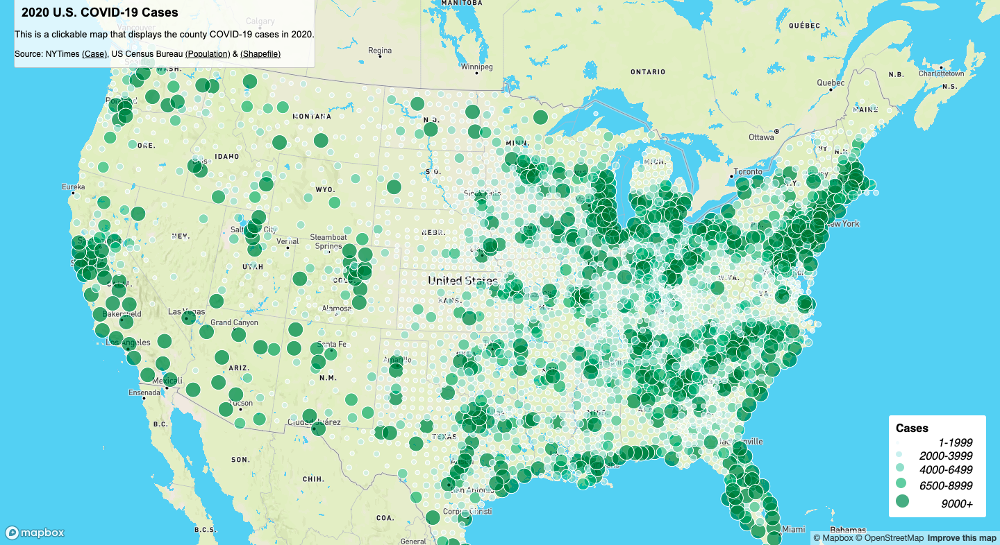

# Covid-19 Maps

This project is about mapping COVID-19 cases and rates in the United States by county level in the year 2020. By navigating through these two maps, the users would have a better understanding of how severe COVID-19 has impacted each county.

By either hovering or clicking the county in these interactive maps, the users will get specific COVID-19 data of the county. 

### Map 1: [COVID-19 Rates Choropleth Map](https://kristinahsu.github.io/covid_data_maps/map1.html)

In this map, users will be able to obtain COVID-19 rates of a particular county by hovering their mouse over the county of interest. The data, which contains the county name, state name, and the rate per 1000 people, would later be presented at the top left box, replacing the prompt "Hover over a county to examine the data!" Using a rates map may be great for understanding the proportion of the population infected, however, each county's population can vary by quite a bit, therefore the infected population can be drastically different too. 

### Map 2: [COVID-19 Cases Propotional Map](https://kristinahsu.github.io/covid_data_maps/map2.html)

In this map, users will be able to obtain COVID-19 cases of a particular county by clicking on a county of interest. The data, which contains the county name, state name, and the cases, would later be presented as a popup window. In addition, this base map was chosen so that only the counties with higher COVID-19 rates would stand out, while those with lower rates would be more blended in with the background. 

### Data Sources
- COVID-19 Cases Data: [New York Times](https://github.com/nytimes/covid-19-data/blob/43d32dde2f87bd4dafbb7d23f5d9e878124018b8/live/us-counties.csv)
- Population Estimation Data: [US Census Bureau](https://data.census.gov/cedsci/table?g=0100000US%24050000&d=ACS%205-Year%20Estimates%20Data%20Profiles&tid=ACSDP5Y2018.DP05&hidePreview=true)
- United States County Shapefile: [US Census Bureau](https://www.census.gov/geographies/mapping-files/time-series/geo/carto-boundary-file.html)

### Technical Recourses
- [GEOG458 LAB3](https://github.com/jakobzhao/geog458/tree/master/labs/lab03)